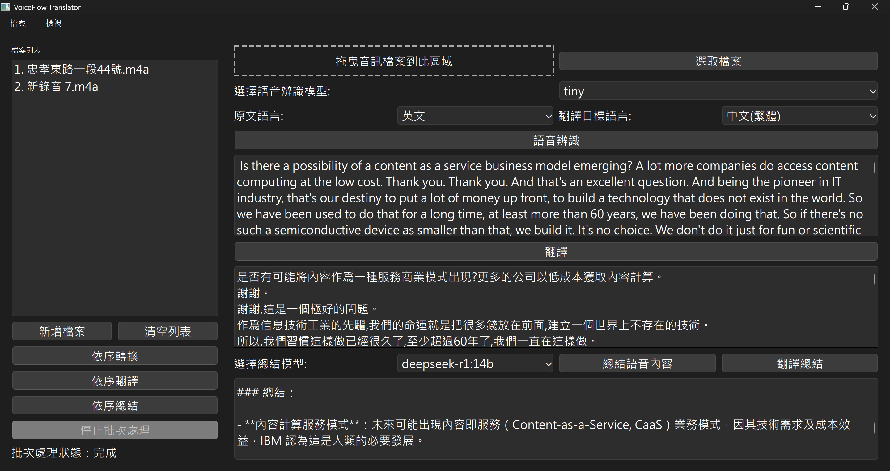

# VoiceFlow Translator

一個基於 PyQt6 開發的語音轉文字、翻譯及總結工具，支援多種語言之間的轉換與智慧總結功能，包含批次處理與模型下載提示。

## 功能特點



- 支援拖放或選擇多個音訊檔案
- 左側檔案列表支援批次轉換、翻譯與總結
- 右側介面支援單個檔案的語音辨識、翻譯與總結操作
- 使用 OpenAI Whisper 進行語音辨識
- 支援多種 Whisper 模型（tiny 到 large）
- 多語言翻譯支援（英文、中文(簡體/繁體)、法文、西班牙文、德文）
- 支援簡繁體中文轉換
- 使用本地 Ollama 模型進行語音內容總結，支援未下載模型時彈出下載詢問視窗
- 總結結果可直接翻譯
- 可調整字體大小
- 支援匯出語音辨識、翻譯及總結結果

## 系統需求

- Python 3.8+
- CUDA 支援（可選，用於 GPU 加速）
- 足夠的磁碟空間（用於下載 Whisper 及 Ollama 模型）
- Ollama 服務（本地運行，用於總結功能）

## 安裝步驟

1. 克隆專案：
```bash
git clone https://github.com/Dylan0624/voiceflow-translator.git
cd voiceflow-translator
```

2. 安裝相依套件：
```bash
pip install -r requirements.txt
```

3. 啟動 Ollama 服務（用於總結功能）：
```bash
ollama serve
```

## 使用方法

1. 執行主程式：
```bash
python main.py
```

2. 在應用程序中：
   * **檔案載入**：
      * 拖放多個音訊檔案至拖曳區或點擊「新增檔案」選擇檔案
   * **批次處理（左側）**：
      * 點擊「依序轉換」進行所有檔案的語音轉文字
      * 點擊「依序翻譯」將所有辨識結果翻譯成目標語言
      * 點擊「依序總結」生成所有檔案的總結
      * 點擊「停止批次處理」中止進行中的批次任務
   * **單檔案操作（右側）**：
      * 選擇檔案列表中的檔案或拖曳單個檔案至右側
      * 選擇合適的 Whisper 模型
      * 點擊「語音辨識」進行語音轉文字
      * 選擇原始語言和目標翻譯語言，點擊「翻譯」處理辨識結果
      * 選擇 Ollama 模型並點擊「總結語音內容」，若模型未下載會彈出下載詢問視窗
      * 點擊「翻譯總結」將總結翻譯成目標語言
   * **結果查看與匯出**：
      * 點擊左側檔案列表中的項目，右側顯示對應的辨識、翻譯或總結結果
      * 使用「檔案」選單中的「儲存語音辨識結果」或「儲存翻譯結果」匯出文字檔案

## 支援的音訊格式

* MP3 (.mp3)
* WAV (.wav)
* M4A (.m4a)

## 注意事項

* 首次運行時會自動下載所需的 Whisper 模型文件
* 若選擇的 Ollama 模型未下載，程式會彈出詢問視窗提示是否下載（需要網路連接）
* 翻譯功能需要網路連接，總結功能需本地 Ollama 服務運行
* GPU 加速需要安裝 CUDA 相關套件
* 批次處理使用獨立線程執行，不會阻塞主介面
* 關閉程式時，記憶體中的暫存結果會自動清除

## 授權說明

本專案採用 MIT 授權條款 - 詳見 LICENSE 文件

## 貢獻指南

歡迎提交 Issue 和 Pull Request。請確保您的程式碼符合現有的程式碼風格。